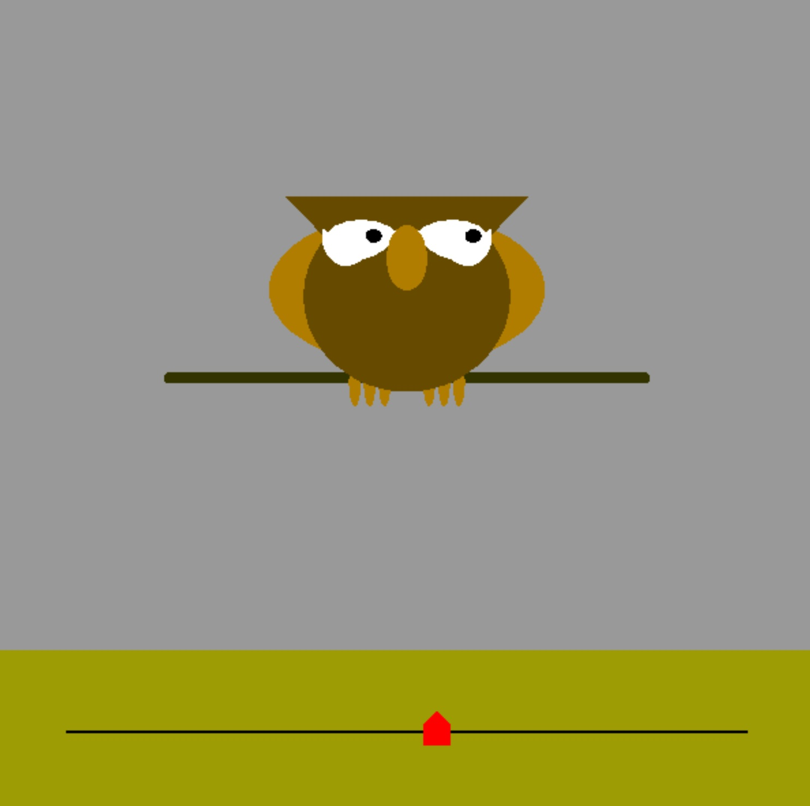
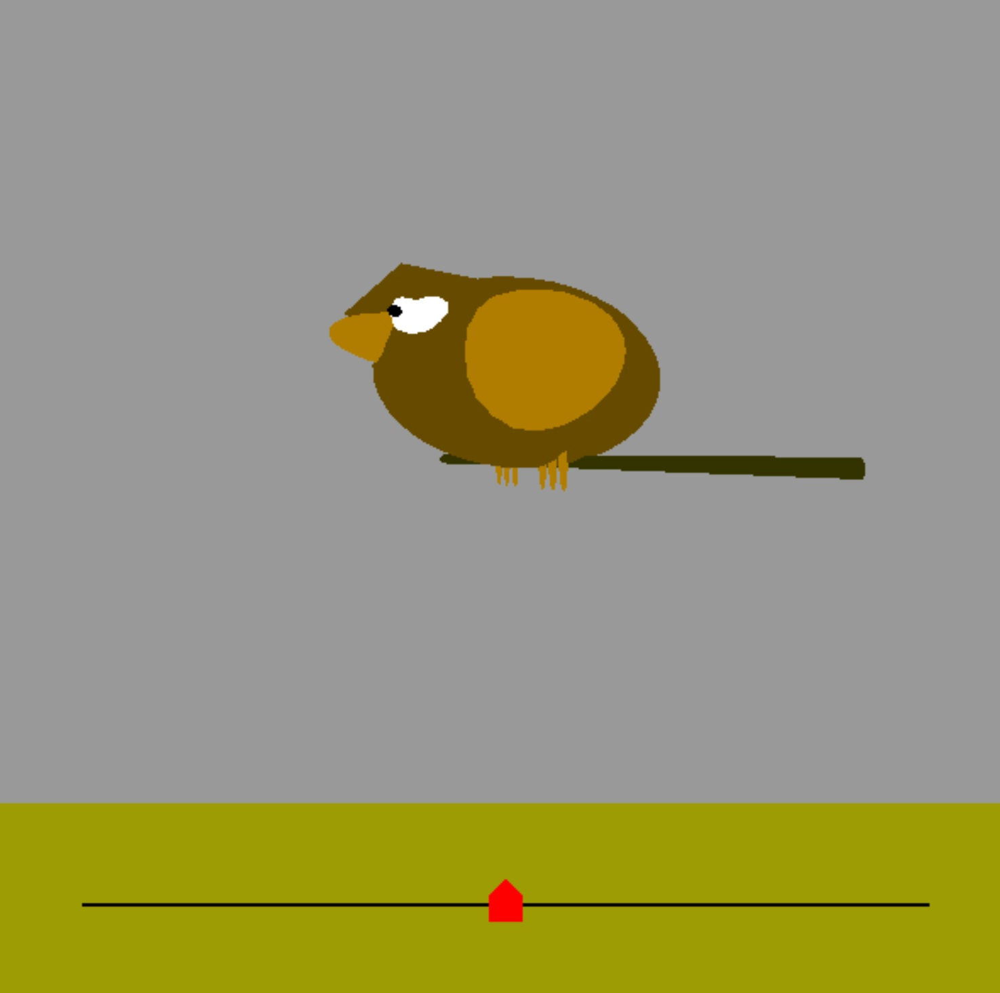

# Owl3D Graphics Project

This project is a simple 3D graphics demonstration using OpenGL and GLUT, creating a scene with an interactive owl and camera controls.


## Screenshots

<p align="center">
    
    
</p>

## Project Description

This project showcases the following features:

*   **3D Scene Rendering:** Renders a 3D scene using OpenGL, including an interactive owl character and a ground plane.
*   **Camera Controls:** Allows user to move and rotate a camera view within the 3D scene using keyboard keys.
*   **Interactive Slider:** Features an interactive slider in the UI that affects the owl's pupil movement.
*   **Geometric Primitives:** Draws spheres and cylinders using custom functions, showcasing basic geometric rendering.
*   **Texturing (Placeholder):** Although texture loading is not part of this version, there is a placeholder texture setup (for the owl bar).
*   **Simple Animation:** Includes basic animation by updating the camera's position and orientation based on user input and slider interactions.

## Features

*   **Interactive Owl:**
    *   A 3D model of an owl with a body, head, and legs.
    *   The owl's pupils move depending on the slider's position in the UI.
*   **Camera Movement:**
    *   Use the arrow keys (left and right) to rotate the camera around the scene.
    *   Use the arrow keys (up and down) to move the camera forward and backward.
    *   Use the `Page Up` and `Page Down` keys to tilt the camera's vertical angle.
*   **Slider Control:**
    *   A slider at the bottom of the screen that affects the position of the owl's pupils.
    *   Click and drag the slider to change the pupil position.
*   **Simple Shapes:**
    *   The scene is composed using spheres and cylinders, to build the main owl body.


## Compilation and Execution

To compile and run this project, you will need:

*   A C/C++ compiler (like GCC).
*   The OpenGL and GLUT libraries.

**On Linux:**

1.  Ensure you have `build-essential` and `freeglut3-dev` installed by running:
    ```bash
    sudo apt update
    sudo apt install build-essential freeglut3-dev
    ```
2.  Compile the code using GCC (or any C compiler):
    ```bash
    gcc main.c -o owl -lGL -lGLU -lglut
    ```
3.  Run the executable:
    ```bash
    ./owl
    ```

**On Windows:**

1.  You will need a C++ compiler installed, like Visual Studio or Mingw.
2.  Install the GLUT libraries for Windows. You can typically find precompiled libraries (DLLs and includes) online.
3.  Compile the code including the correct paths to the libraries and includes.
    *Note: specific commands will depend on the compiler being used, but the libraries are often `-lopengl32`, `-lglu32` and `-lfreeglut`*
4.  Copy the GLUT DLL into the same folder as the executable or make sure it is in a system folder.
5.  Run the executable.

## Usage

1.  Run the compiled executable.
2.  Use the arrow keys to move around the 3D scene.
3.  Use the `Page Up` and `Page Down` keys to change the camera vertical angle.
4.  Click and drag the red slider at the bottom of the screen to move the owl's pupils.

## Code Structure

*   `main.c`: Contains the main logic and rendering functions.
*   `glut.h`: The header for the GLUT library.
